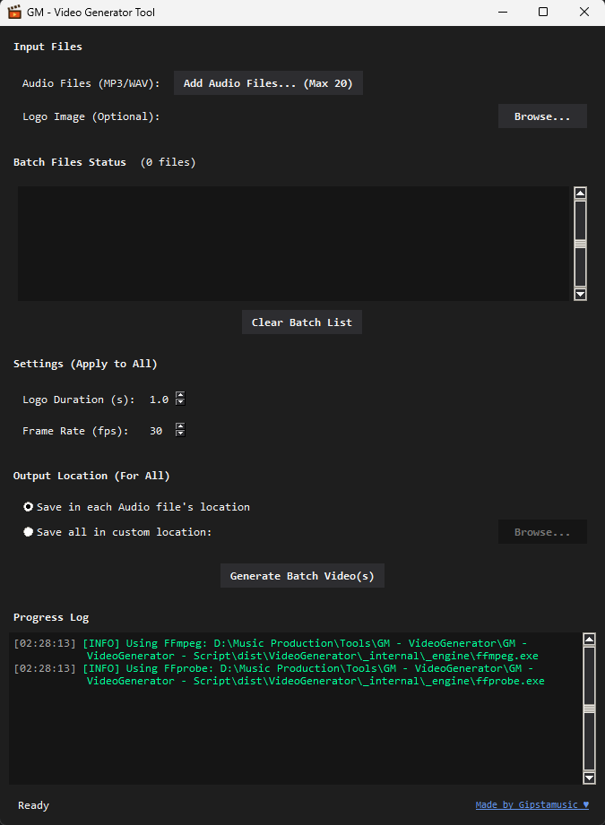

# GM - Video Generator Tool

A robust, automated desktop utility for music producers to instantly turn audio beats and static visuals into high-quality, ready-to-upload MP4 videos.

 <!-- Ensure you add your image! -->

## 🌟 Features
* **Automated Intro/Outro:** Seamlessly fades your producer logo into your beat's cover art.
* **Smart Visual Matching:** Automatically pairs your `.mp3`/`.wav` files with the correct cover art based on filenames or folder contents.
* **HD Rendering:** Strictly enforces and processes visuals at 1920x1080 (1080p) or higher to guarantee YouTube/Beatstars quality.
* **Batch Processing:** Load up to 20 beats at a time and render an entire catalog in one click.
* **No External Dependencies:** FFmpeg is fully bundled. No complex installations or system PATH configuration required.

## 📥 Download and Installation

**For Producers (No coding required):**
1. Go to the [Releases page](../../releases/latest).
2. Download the latest `GM_VideoGenerator.zip` file.
3. Extract the folder anywhere on your computer.
4. Open the folder and run `GM - Video Generator.exe`.

> **⚠️ Note on Antivirus:** This tool is packaged using PyInstaller. Sometimes, Windows Defender or web browsers will flag it as a false positive. The tool is 100% safe, and the open-source code is available in this repository for full transparency.

## 📖 How to Use (Step-by-Step)

**Before You Start:**
* Make sure you have your audio files (.mp3 or .wav) ready[cite: 5].
* Prepare a Logo Image (recommended size: 1920x1080 or larger)[cite: 5].
* Prepare a Visual Image for each song (like a cover art or background)[cite: 5].

**Step 1: Add Your Audio Files**
* Click the **Add Audio Files** button[cite: 5].
* Select one or more MP3 or WAV files (up to 20 at a time)[cite: 5].

**Step 2: Upload Your Logo (Optional)**
* Click the **Browse...** button next to the Logo field[cite: 5].
* Choose your HD logo image[cite: 5]. If you leave this blank, the video will jump straight to the cover art without an intro.

**Step 3: Match Visuals**
* The app will try to find a matching image based on the audio file name automatically[cite: 5].
* Example: If your audio is `My Song.mp3`, try naming the visual `My Song.jpg`[cite: 5].
* If no exact match is found, the app will look for an HD image in the same folder[cite: 5].

**Step 4: Adjust Settings**
* **Logo Duration:** Choose how many seconds your logo will appear at the start (default is 1.0 seconds)[cite: 5].
* **Frame Rate:** Pick how smooth you want the video (30 FPS is recommended)[cite: 5].
* **Output Location:** Choose if you want the videos saved in the audio folder or a custom folder[cite: 5].

**Step 5: Generate**
* Click the **Generate Batch Video(s)** button[cite: 5].
* Progress will be shown in the log at the bottom of the app[cite: 5]. Your new videos will be saved as `.mp4` files in the folder you selected[cite: 5].

## 🛠️ Troubleshooting
* **No Logo or Visual Found:** Make sure you uploaded a logo and placed images with the correct names[cite: 5].
* **Image Not HD:** Only images 1920x1080 or bigger are accepted[cite: 5]. Use good quality visuals[cite: 5].
* **Batch Stuck:** Check that your audio and images are not corrupted and try again[cite: 5].

## 📄 License
This project is licensed under the MIT License - see the `LICENSE` file for details.

## ❤️ Support
Made by Gipstamusic. 
[All Socials](https://lnk.bio/gipstamusic)